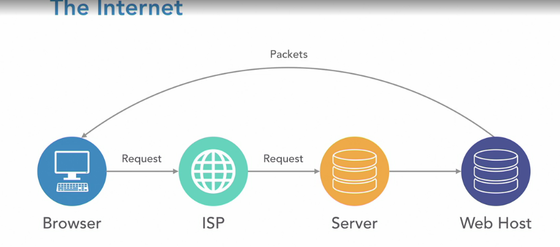
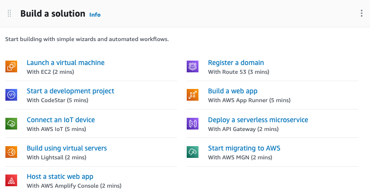
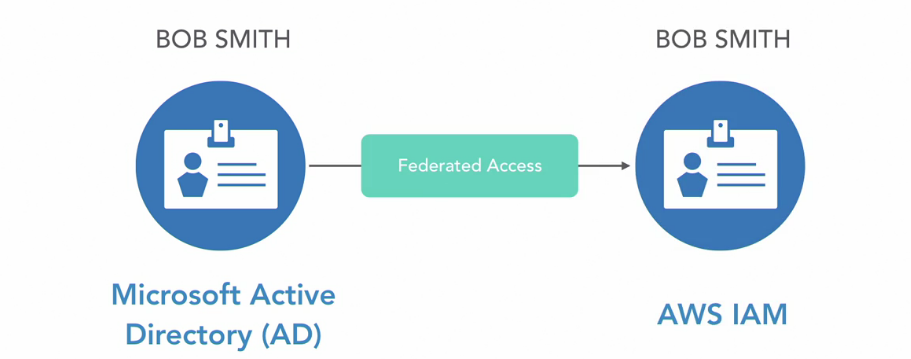
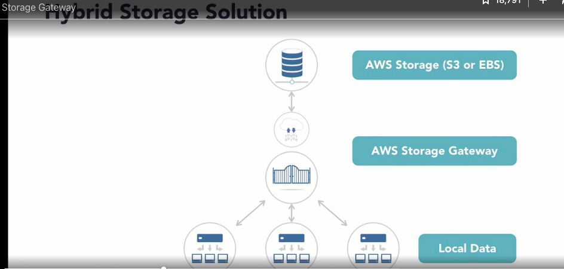
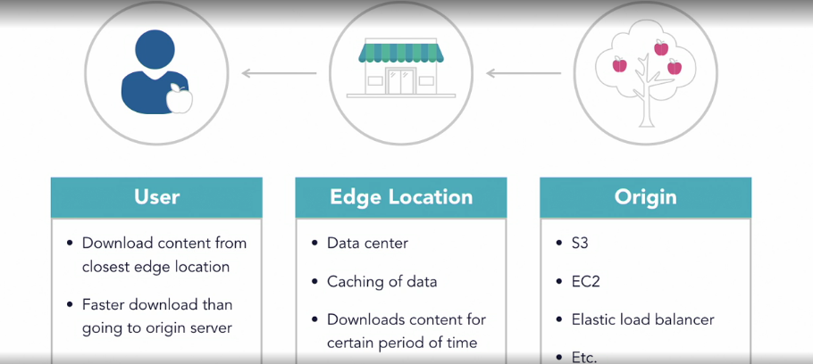
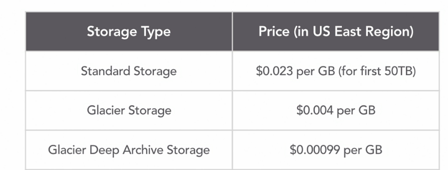
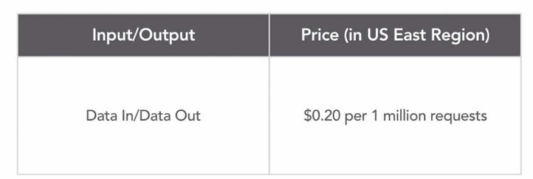

AWS
important links
https://digitalcloud.training/category/aws-cheat-sheets/aws-cloud-practitioner/

| Key word     | Description |
| ----------- | ----------- |
|Exam tips| <li> Most fundamental exam <li> Define the AWS Cloud and its value proposition <li> Identify aspects of AWS Cloud economics <li> List the different cloud architecture design principle|
|Exam|90 min - 65 questions multiple choic or multiple response|

## Overview of the objectives and keypoints

| Key word     | Description |
| ----------- | ----------- |
| Cert    | <li> Validates overall understanding of the AWS cloud <li> At least six months of experience witht the AWS Cloud and basic understanding  <li> Industry-recognized credential validating knowledge of IT services recommended  <li> 100 USD per exam <li> 90 min of multiple questions  <li> Broad understanding of the AWS Cloud, but no hands-on tasks <li> All multiple-choice questions <dt>Exam topics  <dd> - cloud concepts 26% <dd> - security and compliance 25% <dd> - Technology 33% <dd> - Billing and pricing 16% |
|1. Cloud Concepts| <li> Define the AWS Cloud and its value proposition <li> Identify aspects of AWS Cloud economics <li> Describe different cloud architecture design principles <li> list the different cloud architecture design principles|
|2. Security and Compliance|<li> Define AWS shared responsibility model <li>Define AWS Cloud security and compliance concepts <li> identify AWS access management capabilities <li>Identify resources for security support|
|3. Technology|<li> Define method of deploying and operating IT applications in the AWS Cloud <li> Define AWS global infrastructure <li>identify the core AWS services <li>identify ways to contact support|
|4. Billing and Pricing |<li>Tricky questions <li> Because you need to be able to remember different pricing models for AW <li>Recognize various account structures in AWS billing and pricing <li> Identify resources available for billing support| 
|Cloud |Cloud = internet   Internet = Global network of connected devices  |
|Cloud computing|On-demad delivery of compute, databse storage, application, and other IT resources   pay as you go   Collaboration with cloud computing <li> Hold virtual meetings <li> Edit documents together <li> Communicate with messaging services <li> Send email   Cloud Computing Features <li> Instantaneous access <li> Access resources where and when you want <li> More flexible and affordable than legacy IT infrastructure <li>Affortable for organizations and individuals with smaller budgets|
|Advantages|<li>No need for physical server or cabling <li> No need for for server room setup or maintenance <li> No hardware replacement or procurement <li> Pay only and what you consume <li> Scale up or down instantaneously and only pay for what you use <li>Benefit from economy of scale|
|6 major advantage to cloud computing|<ol> <li> Trade capital expense for variable expense<li>Benefit from massive economies of scale <li>Stop guessing capacity <li>Increased speed and agility <li> Stop soending money running and maintaining data centers <li> Go global in minutes </ol> 
|3 main Cloud computing models| IaaS (host) - AWS, MS Azure, Google cloud <li> Basic building blocks <li> Most flexibility and management control <li> Closest to having traditional on-premises data center     PaaS (build) - MS Azure web hosting, Google app Engine, Heorku <li> Deploy and manage applications without worry <li> Execute programming languages to host applications <li> Less flexibility than Iaas, as packages are preconstructed   SaaS (consume) - Dropbox, salesforce, zoom<li> Completed products managed by the service provider <li> Easy to use as end user <li> Least flexibility |
|Cloud Deployment|<li> 100% IT infrastructure on the cloud <li>All applications migrated to or created in the cloud <li> Removes roadblock of costly and time-consuming procument processes|
|On-Premises/Private Cloud Deployment| <li> Use virtualization to deploy resources in their on-premises data centers <li>Often looks like traditional IT infrastructure <li> Does not provide a lot of benefits of cloud computing <li> Resources cannot be accessed using the internet <li> Security: provides dedicated resources    The setup does not provide a lot of benefits of cloud computing. The resources are not accessed using the internet because they are on-site. This means you can access them really quickly because nothing has to be uploaded or downloaded using the internet. However, it could utilize application management and virtualization technologies to increase efficiency of the available resources, such as by deploying virtual machines and internet resources behind a firewall. On-premises deployment provides dedicated resources which means that the organization is not sharing any part of their resources with another organization. This may be a requirement for certain industries that take data privacy very seriously, such as the medical field.|
|Hybrid Cloud Deployment|<li> Connects on-premises technology with cloud-based resources <li> Great for established companies that are in the process of migrating over the cloud. Hybrid deployment allows organizations to extend and scale their infrastructure into the cloud while still maintaining access to on-premises resources living on on-site servers|
|Cloud computing-design priciples   5 best practices | build the most secure, durable, efficient, and high-performing IT infrastructure possible   How? <li>avoid unnecessary costs   by using only what you need, turning off unused servers, Reserving resources in advance, contnuous monitoring <li> Reliability ( A reliable system has the ability to recover from service disruptions often by itself)  by dynamically adjusting computing resources at demand,testing your disaster recovery settings and incorporating redundancies in your infrastructure (Redundancy refers to the concept of having duplicate copies of resources so that when one goes down the other can take over to provide seamless cut over experience for end users) <li> Efficiency    Performance efficiency is the ability to use computing resources to adjust to system requirements. It should allow for more experimentation and when a change is set in motion, should be able to go global in minutes <li> infrastructure security    This includes security of information, systems, and assets. Security best practices should be automated. Data should be protected in transit and at rest, which means when it's being moved from one location to another, as well as when it's being stored. Traceability should be enabled, along with strong identity foundation.  in case of a security breach, you are able to see who did what at any point, because every user has a unique user account or access key. Who can do and access what should be well defined and followed <li> Operational excellence   by improving ability to run and monitor systems while constantly improving processes and procedures. Everything should be documented and operational procedures should be frequently refined. Failures should be anticipated and learned from, and systems and processes updated to take them into account. If an incident occurs, such as a major service downtime, the whole team should come together to discuss what went wrong, how it could have been prevented, and set up procedures in case it happens again.|
|Summary|<li> Advantages of cloud computing over legacy on-premises IT infrastructure <li> Cloud computing models <l> Cloud computing deployments <li>Design priciples of cloud computing (like Well-Architected Framework)    <b> 6 advantages of Cloud Computing </b> <li> Trade capital expense for variable expense. <li> Benefit from massive economic of scale <li>stop guessing about capacity <li> increase speed and agility <li> stop spending money running and maintaining data centers <li> go global in minutes.     <b> 3 Cloud Computing Models </b><li> SaaS <li> IaaS <li> PaaS    <b> 3 Cloud Computing Deployments </b> <li>public Cloud <li> Hybrid Cloud ,<li> Private Cloud     <b>5 pillars of a Well-architected Framework </b><li> Cost Optimization <li> Reliability <li> Operational Excellence <li> Performance Efficient|

## Introduction to AWS
| Key word     | Description |
| ----------- | ----------- |
|AWS history|<li>Amazon.com Web Service launched in 2002 <li> Amazon was planning to launch Merchant.com - an ecommerce platform to third-party shops <li> The platform paved the way for Amazon <li> The platform paved the way for Amazon to evolve from "online store" to "service company"   AWS   <li> a decade and a half old <li> Growing exponentally every year  <li> Over 1 millian active customers <li> 10% of Amazon's revenue came from AWS in 2017 |
|What is AWS?| <li> AWS offers IT infrastructure services to businesses and organizations as web services to help them scale and grow efficiently. <li> AWS provides what used to be purchased as hardware, such as network switches and servers, as resources to be accessed using the internet. <li> Because of cloud computing's pay as you go model and robust resources, organizations are able to save time, money, and human resources by moving their resources to AWS.   AWS Services by Groups  As of winter 2020, there are 24 groups of services offered by the platform ranging from compute to storage to game development. Each group contains anywhere between one to 12 services with more being added all the time. You can host your static files using simple stores service, host a WordPress blog using elastic compute cloud, send emails using work mail, stream desktops using workspaces or create games using game lift.  It's probably not far from the truth to say that your imagination is the limit for what you can potentially architect and create using Amazon Web Services.  As a cloud computing service provider, AWS boasts flexibility, scalability, and reliability alongside affordability that was impossible with traditional on premises IT infrastructure. With AWS, engineers can concentrate on building your products and features instead of worrying about the it infrastructure's ability to handle their scaling.   |
|AWS business| Over 1 Million customers (Airbnb, General Electric, Dow Jones, Kellogg's, Atlasian, Netflix,  Citrix, Square Enix, Spotify, USDA, UK Ministry of Justice,)|

## Diving into AWS
| Key word     | Description |
| ----------- | ----------- |
|Popular services offered in AWS|<b><u>Compute Services </u></b> backbones of cloud computing platforms <li>virtual server hosting <li> container management <li>serverless computing <li> set code to run to certain triggers using Lambda <li> run virtual machines using EC2 <li> quickly set up and run small websites using LightSail <li>easily deploy containerized workloads on AWS using ECS    <b><u>Storage Services</u></b>  Storage solutions are cheaper than ever with cloud <li> Storage for both in-use and archival files <li> Create EFS to create shared folders <li> upload flatfile like images, videos, text files to S3 and link to it directly to use on your website <li> archive and large amount of data for cheap using Glacier <li> Storage Gateway to take daily backups   <b><u>Database Services </u></b>All of the database services are highly scalable and cost efficient <li>fully-managed cost efficient relational and NoSQL databases RDS and DynamoDB <li> fully managed, easily scalable petabyte-scale data warehouse service called Redshift <li>highly scalable caching service called ElastiCache|
|create an AWS account -support plan| personal with Basic support plan.  Basic Plan, Developer Plan, Business Plan and Enterprise. Basic Plan, Developer Plan, and Business Plan.|
|AWS dashboard|    all services   most popular catogories- Storage, compute and Database  |
|AWS free Tier|https://aws.amazon.com/free   When the 12 months are over, you begin to be charged for services you consume at regular rates. As a warning, you will get a notification when your 12 months are expiring  There are three different types of Free Tier offerings. They are:  12 months free  All of the services have usage limits, and if you go above the limit, you will be charged at normal rates even within the first 12 months. Some of the common limitations are use time, number of requests, amount of storage, number of characters, and actions per month  always free  it's always free, up to a certain point trials Most of the trials are for less than 12 months, and have stricter limits.    one important thing is that being on the AWS Free Tier plan doesn't mean you have unlimited use of everything. Depending on the service, there are different limits.|
|Use case|WordPress AMI on EC2 <li> Elastic Compute Cloud (EC2) = Virtual server on AWS <li>Host websites like WordPress <li>Amazon Machine Images (AMI) = Preconfigured servers in AWS Marketplace <li> AMI for WordPress blogs called WordPress Certified by Bitnami <li> Free Tier eligible, and runs on Ubuntu server ,li> WordPress blog on EC2   EC2 urls)very long ec2-52-204-122-132.compute-1.amazonaws.com.   solution - Route 53   |

##  Security and compliance domain
| Key word     | Description |
| ----------- | ----------- |
|Security and compliance | <li> Define the AWS shared responsibility model <li> Define AWS Clod security and compliance concepts <li> Identify AWS access management capabilities <li>Identify resources for receiving security-related support|
|Security in the cloud|<li> Global network of data centers buit with security in mind <li> Safeguards to protect customer privacy <li> Dozens of compliance programs to help meet inustry compliance requiremnts for data security <li> High-security standards without need for your own data centers <li> Scale your business quickly|
|Shared Responsiility Model|<b>Your responsibility vs AWS's reponsibility</b>  Security of cloud computing infrastructures and sata is a shared responsibility between the customer and AWS.   AWS :Security of the cloud &nbsp; vs &nbsp; You/Customer:Security in the cloud|
|AWS: Security of the cloud|AWS is responsible for protecting the infrastructure, such as physical security of data centers hosting the AWS cloud <li> AWS is responsible for the security of the components that make up the AWS Cloud<li> Security of hardware, software, networking etc that runs the cloud computing services |
|You: Security in the Cloud | The customer is responsible for security of things inside the AWS Cloud.   You are responsible for varying levels of security functions, depending on the AWS Cloud service used, such as: <li> Protecting customer data and data encryption <li> Identity and Access Management <li> Patching operating systems of VMs <li> Configuring firewall|
|Aecurity pillar from Well-architected framework| <li> Identity and Access Management (IAM) <li> Detective Controls <li> Infrastructure Protection <li> Data Protection <li> Incident Response|
|Strong identity foundation| <li> principle of least privilege (you only provide access to what people need to do their jobs, no more) <li> traceability by monitoring alerts, audit actions and changes <li>  Security should be applied on all layers instead of just on a single outer layer of your infrastructure <li> For a virtual server, this could mean that you make sure your infrastructure is secured at the organizational subnet, load balancer virtual machine in the operating system layers  <li> Best practices should also be automated, so that you can scale more rapidly and cost effectively <li> security methods are automated, You can just replicate that for every new instance or resource you deploy instead of having to manually set them up <li> data should be protected at rest, in transit data at rest, when stored in S3 bucket <li>  Security mechanisms should be adjusted depending on sensibility of the data <li> eliminate the need for direct access or manual processing of data  (human error and loss or modification of sensitive data can be prevented) <li> You can strive for stability by focusing on protecting the data and resources against security events. And when an event occurs to learn from the event and update Incident Management procedures.|
|Principle of least privilege|<b>Who can access what</b>   Every role has a set of access permissions necessary to effectively complte its job, and the individual in the role should have no more or no less than the optimal level of access <ol><li> Use identity Access Management (IAM) to provide access <li> You can provide access to resources to both users and other AWS services <li> Start with minimum set of permissions, and grant aditional only as necessary <li> Determine what user/service needs to be able to do and craft policies to perform only those specific tasks </ol>|
|AWS Cloud compliance|find information on https://aws.amazon.com/compliance/programs.|
|cert points| <li> Security in the cloud <li>Shared responsibility model <li> Security pillar of the Well-Architected Framework <li> Principle of least privilege <li> AWS Cloud Compliance |
|IAM| <li> Manage access to services and resources on the AWS Cloud <li> Manage users and groups <li> Can provide access to users or other AWS services <li> Permissions are global: any access setting will be true across all regions <li> Follow principle of least privilege|
|Method 1: Manage IAM users | <li> Create users in IAM and assign them security credentials <li> users can have very precise permission sets <li> user can access AWS through AWS Management Console <li> You can provide programmatic access to data/resources <li> Programmatic access: applications directly accessing resources instead of humans doing the same activity|
|Method 2: Manage IAM Roles|<li> Create roles to manage permissions and what those roles can do <li> An entity assumes a role to obtain temporary securitycredentials to make API calls to your resources <li> Used to provide access to a user from another AWS account to your AWS account. ie seperate dev and prod environment|
|Method 3: Manage Federated Users| <li> Enable identity federation: allow exisitng identities in your enterprise to access AWS without having to create IAM user for each identity. ideal for lists   |
|Benefits of IAM|<li> Enhanced security <li> Granular control <li> Ability toprovide temporary credentials <li> Flexible security credential management <li> Federated access <li> Seamless integration across various AWS services|
|AWS Web Application Firewall (WAF)| Protect apps from exploits that could force your app to consume excessive resources and can be expensive. With WAF you only pay for what you use.<li> Protects web apps running on the AWS Cloud from common web exploits <li> Firewall services for web applications <li> Protect web apps against exploits that could compromise security or availability <li> improves web traffic visibility <li> Provides cost-effective web app protection <li> Increased security and protection against web attacks <li> Easy to deploy and maintain (Amazon cloud front/Amazon API Gateway)   in short AWS WAF is an affordable, malleable, and adaptable protection for your web applications running on AWS Cloud that is easy to manage and deploy. |
|malicious attacks|<b>DDos Attack</b> <li> A Distributed Denial of Service Attack or DDoS attack is an attempt to make a machine or network resource unavailable temporarily or indefinitely, <li> most often by making excessive repeated access requests to the website using thousands of unique IP addresses. Basically, a hacker or malicious personal organization would overload the server with access requests so that real users can't access the website because it's to busy. AWS has a service called AWS Shield, which provides detection and automatic mitigations to minimize the effects of DDoS attack on your applications.  |
|AWS Shield| <li> Provides detection and automatic mitigations <li> Minimise the effects of DDos attacks to your apps <li> Helps minimize application downtime and latency when an attack happens   There are 2 tiers in terms of protection and cost <ol><li> Standard tier - automatically enabled, free to use and protects against majority of common DDoS attacks, Get comprehensive availability protection against all known infrastructure attacks when used with CloudFront and Route 53. <li> Advanced tier- Continuous, 24/7 access to AWS DDoS response team, Near real-time visibility into events, integrates with AWS WAF, Provides higher-level protections, network and transport layer protections, and automated applications traffic monitoring   Financial protection against DDoS-realted spikes in charges for EC2, elastic load balancers, CloudFront, and Route 53.   Available globaly on all CloudFront and Route 53 Edge locations, Your web application can be hosted anywhere in the world and still be protected by AWS Shield. Comprehensive protection against DDoS catered to your budget and needs</ol> you can start with standard proction and upgrade as it scaled |
|Inspector| provide your auditors and your development team a peace of mind knowing that the applications adhere to security standards set by the company and the industry as a whole.  <li> Amazon Inspector is an automated security assessment service for your applications deployed on AWS. <LI> Automatically assess for exposure, vulnerabilities, and derivation from best practices <li> Generates details report to help check for vulnerabilities <li> Security teams can get reports validating that tests were performed <li> Reduce risk of introducing security issues during deployment and development <li> You can define standards and best practices <li> Or use the AWS constantly updated standards|
|Trusted Adviser|<li> Guides provisioning of resources to follow AWS best practices <li> Scans your infrastructure and advises you on how it is or is not follwing AWS best practices <li> Based on five categories:cost optimization, performance, security, fault tolerance, service limits <li> Provides action recommendations to meet best practices   All AWS customers have access to seven core trusted advisor checks for free. <ol><li> S3 bucket permissions <li> Security groups-specific ports unrestricted <li> IAM use <li>MFA on root account <li> ESB public snapshots <li>RDS snapshots <li> Service limits</ol>    For those with enterprise or business support plans, there are extended set of checks and recommendations available.   Full Trusted Advisor checks <ol><li>More types of checks on top of core checks <li> Notifications through weekly updates <li> Set up automated actions in response to alerts using CloudWatch <li> Programmatic access to scan results via AWS Support API</ol>|
|GuardDuty| it's a threat detection service that monitors for malicious activity and unauthorized behavior to protect your AWS Cloud instance 24/7. <li> 24/7 threat detection service for the AWS cloud <li> Monitors for malicious activity and unauthorised behaviour <li> Analyzes events to send actionable alerts via CloudWatch <li> Amason GD uses machine learning, anomaly detection, and integrated threat intelligence to identify potential threats <li> Easy to deploy    In short  Amazon GuardDuty continuously monitors your AWS Cloud infrastructure, intelligently detects threats using machine learning and helps you take action immediately if a threat is found |

## Core Services - Compute
| Key word     | Description |
| ----------- | ----------- |
|Technology domain| Four parts   <li> Define methods of deploying and operating in the AWS Cloud <li> Define the AWS global infrastructure <li>Identify the core AWS services <li>Identify resources for technology support.|
|EC2|Amazon Elastic Compute Cloud. it's one of the most widely used services in the AWS. Amazon EC2 allows you to launch applications and servers when you need them without upfront financial commitments. It's integrated with many other AWS services, is reliable and secure, and allows you or your company to quickly and inexpensively spin up instances of virtual servers for all of your different needs.<li>Virtual server running on AWS <li> Configurabl by number of virtual CPUs, GBs of RAM, size/type of storage, and network speed <li>Only charged for what you use, when you use it <li> Deploy extremely scalable and reliable virtual servers within minutes |
|Elastic Beanstalk| If you're constantly frustrated by the amount of time you spend managing configuring servers, databases, firewalls and networks, perhaps its time you give AWS Elastic Beanstalk a try <li>Handles the deployment process, including the capacity provisioning, load balancing, auto scaling and application health monitoring. <li> You can upload services developed using JAVA, .NET, PHP, Node.js, Python, Ruby, Go and Docker <li> You retain control over resources at all times <li>  it's free to use and you only pay for the AWS resources needed to store and run the web applications you've deployed. <li> It automatically scales your applications up and down based on its specific needs. <li> complete freedom to select the AWS resources such as the EC2 Instance type that you want to use for your application <li> Allows manual management of infrastructure|
| Elastic Beanstalk vs EC2|EC2 is Amazon's service that allows you to create a server (AWS calls these instances) in the AWS cloud. You pay by the hour and only what you use. You can do whatever you want with this instance as well as launch n number of instances. Elastic Beanstalk is one layer of abstraction away from the EC2 layer. |
|Elastic Load Balancing| Elastic load balancers are highly available, secure, flexible, and monitorable allowing you to glean robust information about your traffic as well as providing you the confidence that your applications are up at all times.  Elastic Load Balancing automatically distributes your incoming traffic across multiple targets, such as EC2 instances, containers, and IP addresses, in one or more Availability Zones. (so no single server is overloaded) <li>It monitors the health of its registered targets, and routes traffic only to the healthy targets. (Fault-tolerant) n<li> Scalable and secure    <b> 3 types of elastic Load Balancing </b>  Elastic Load Balancing supports the following types of load balancers: Application Load Balancers, Network Load Balancers, and Classic Load Balancers. Amazon ECS services can use these types of load balancer. Application Load Balancers are used to route HTTP/HTTPS (or Layer 7) traffic.|
|Lambda| <li> Runs code (Lambda function) in response to an event . eg: user uploading an image  into an S3 bucket. user tapping a button on your mobile app to buy an item <li> Automatically runs uploaded code and scales applications <li> Pay only for the ode is running and each event trigger <li> No need to provision and maintain servers |
|Lightsail|Amazon Lightsail is a virtual private server (VPS) provider and is the easiest way to get started with AWS for developers, small businesses, students, and other users who need a solution to build and host their applications on cloud (quick development or test environment spun up) <li>designed to scale, scalable with your project's growth <li>cost effective monthly fees <li> use it to deploy simple web applications, create websites, run your business's software, or spin up developer or test environments <li>User-friendly  one-click-to-launch services without engineering know-how<li> There are many preconfigured and ready-to-use operating systems, web apps, and development stacks.  eg : WordPress, Windows OS, Ubuntu and Node.js|
|Deploying and operating in AWS|AWS users can manage and deploy resources in the AWS cloud in three ways <li> AWS Management Console <li> AWS Command-Line Interface (CLI) <li> AWS Software Development Kits (SDKs) |
|AWS Management Console| <li> Graphical interface that supports most AWS services <li> Can access billing statements, launch new services, check out health of web apps, and so on. <li> User-friendly and easy to navigate |
|AWS Command-Line Interface (CLI)|<li> Access AWS services via the command line <li> Command line: access and change resources via text-based command entry <li> Programming language agnostic   eg: service to shut down, or add new file to an S3 bucket|
|AWS SDKs| <li> Incorporate connectivity and functionality of a wide range of AWS services into your code <li> Deploy AWS services and resources using a variety of popular programming languages <li> Use AWS resources in exisitng applications   eg: The AWS SDK for Java simplifies use of AWS Services by providing a set of libraries that are consistent and familiar for Java developers. It provides support for API lifecycle consideration such as credential management, retries, data marshaling, and serialization|
|CLI vs SDK|AWS CLI's and SDK's allow you to create tools that are specific to your organization, and help create an environment that utilize infrastructure as code. With infrastructure as code, you can write code that describes the configurations for specific AWS Cloud services, and they can be deployed for you by AWS. It helps to speed up the deployment process, and removes the risk of human error when spinning up new resources. Some AWS Cloud services that utilize infrastructure as code are Elastic Beanstalk, AWS Lambda, and AWS CloudFormation.|
|AWS Global infrastructure| <ol> <li>Availability Zones (AZs)   - AWS data centers around the world   - Completely independent of each other in network and power source   - Currently almost six dozen Availability Zones (AZs) around the world  <li> Regions   - Made up of two or more Availability Zones   - Currently two dozen AWS Regions around the world.   When a brand new service is introduced, it's generally first introduced in a few specific regions as opposed to the whole world. Some of the regions that receive new services earlier are US East North Virginia, US West North California, some Asia Pacific regions like Singapore, Sydney, and Tokyo, and some areas in the European Union like Frankfurt and Ireland. This fact may influence which region you decide to use to host your infrastructure.   Generally, you would choose a region closest to your physical location to host your AWS cloud infrastructure, because you can reduce network latency for your end users     Some regions cost more than others. And service level agreements, or SLAs, also vary by region.    You may also have compliance requirements to meet, which may require you to host your resources in specific regions or multiple regions. Hosting your resources in multiple availability zones, or even regions, help create what is known as high availability</ol> |
|High Availability| <li> Highly avaialble resources may have duplicate copies in multiple Availability Zones or even Regions <li> Resiliency: Ability to provide uninterrupted performace. even during natural disasters <li> Redundancy: Having multiple copies of data in different data centers <li> Architect your AWS Cloud infrastruture to protect against downtimes caused by natural disasters or power outages|

## Core Services - Storage
| Key word     | Description |
| ----------- | ----------- |
|S3|AWS has a solution to all of your static file storage called Amazon Simple Storage Service or Amazon S3 <li> Object storage service: storing each file as sperate entity (object) <li> High availablity, security, and performance <li>Scalable <li> Charged only for waht you use <li> 99.999999999% durable <li> Upload files (objects) of all sizes (0byte ~ 5 terabytes) <li>Variety of uses: Use uploaded files for websites, mobile apps, backup and archiving,enterprise applications, IoT devices, big data analytics <li> Easy-to-use management features to fine-tune access controls |
|S3 storage classes|Whatever your needs for object-based files storage may be, ranging from using photographs for your website or spending as little money as possible to backup your organization's files, Amazon S3 would have an option that works for your budget and needs.<ol><li>S3 Standard <li> S3 Intelligent-Tiering <li>S3 Standard-Infrequent Access (Standard-IA) <li> S3 On Zone-Infrequent Access(One Zone-IA) <li> Glacier <li> Glacier Deep Archive</ol>|
|Elastic Block Store| You can think of EBS volumes as external hard drives for your virtual servers, taking advantage of scalable, durable, and reliable storage options using Amazon EBS will make scaling your IT operations a breeze. <li> Raw, unformatted block device attached to an EC2 instance <li> Can add multiple EBS volumes to one EC2 instance <li> Use as file systems or hard drives <li> Dynamically change configurations to attached volumes via management console <li> Automatically replacted within its availability zone <li> Different types of EBS storage types for your needs and budgets <li> Persisitence block storage volumes: do not disappear when EC2 instances are rebooted <li> Can be encypted <li> Exist independetly of EC2 instances so can be moved to other instances|
|Snowball| AWS Snowball is one of the very few hardware solutions from AWS<li>it is a data migration tool. <li> AWS will physically ship you a Snowball to move your data onto, and then mail it back so you can migrate huge amounts of data. <li>  The amount of data you can move into AWS Cloud ranges from 50 terabytes with regular Snowball up to 100 petabytes with a Snowmobile, a 45-foot-long ruggedized shipping container pulled by a semi-trailer truck <li> Usage fee: free for 10 days of onsite usage; extra usage for every extra day you keep it. <li> Service fee per job starting at $200 <li> Storage fee: storge fee for data transferred into s3 (but no transfer fee) <li> Snomobile: expensive!|
|How snowball works|   For large amounts of data, the transfer up to the cloud could take months, even with a high speed Internet connection. With AWS Snowball the same transfer can be accomplished in less than a week using two Snowball devices, with a few days tacked on for shipping|
|Storage Gateway| Basically, it creates a gate that connects your on-site users and devices to the resources stored in AWS Cloud with minimal latency.      It connects your on-premises storage with AWS Cloud Storage, providing a hybrid storage solution for your IT infrastructure. The service seamlessly integrates on-premises enterprise applications and corporate workflows with AWS's Cloud Storage Services through the use of a virtual machine installed onto an on-premises data centers host server.   AWS offers three types of Storage solutuions to fit your needs   <li> File based <li> Volume based <li>Tape based|
|AWS Storage Gateway: File Gateway| <li> Files stored as objects in S3 <li> 1:1 representation of each file <li> Asynchronously updates objects to S3 as local files are updated <li> Local cache to provide low-latency access to recently accessed files|
|AWS Storage Gateway: Volume Gateway | <li> Upload files in blocks (like virtual hard drives) <li> Asynchronously backed up as point-in-time snapshots and stored as Elastic Block Store snapshots  <li> 2 types   Stored volume: complete copy on-premises:sends snapshots to AWS   Cached volume:keeps most recently accessed data on-premises; comple copy on AWS|
|AWS Storage Gateway: Volume Gateway|<li> Uses exisitng tape-based backup infrastructure to back up to virtual tapes <li> Data stored locally then asynchronously uploaded to S3 <li> Data can be archived using Amazon Glazier |
|AWS Storage Gateway Pricing|<li>You'll pay for storage and to access the stored data <li> The quicker you can access the data, the more expensive the solution is <li> For example, data stored via tape gateway is much cheaper saved to S3 Glacier Deep Archive than S3 Glacier <li> Virtually unlimited throughput and storage <li> Serverless: no need to provision, manage, or update your own servers <li> Compatible with PostGreSQL, MySQL, MariaDB, Oracle Database, Microsoft SQL server, and Amazon Aurora. <li>If you already have existing databases, you can use AWS Database Migration Service to migrate or replicate them into Amazon RDS as well|

## Core Services - Database
| Key word     | Description |
| ----------- | ----------- |
|Amazon DynamoDB|<li> Secure, scalable, fast, and flexible NoSQL database <li>  DynamoDB will adapt with your needs so that your application speed and stability remains high <li>DynamoDB is serverless which means that you don't have to provision, patch or manage any servers. <li>  AWS automatically scales your tables up and down to adjust for capacity and to maintain performance as well as maintaining stability with redundancies and fault tolerance.<li> DynamoDB is being utilized in many well known companies like Nikee, Snapchat Lyft and Netflix.|
|Amazon Relational Database Service RDS| <li> set up, operate, and scale a relational database with just a few clicks <li> It's cost efficient. Only pay for what you use or reserve at on-demanding pricing (cheaper) <li> AWS takes care of the provisioning, monitoring and maintaining the database <li> AWS make sure your databases are highly available, durable, scalable, fast and secure|
|Amazon Aurora| Amazon Aurora is one of the six relational database engines that you can use in Amazon Relational Database Service, or RDS. It's fully managed by Amazon RDS, which relieves engineers of having to engage in time consuming administrative work, like provisioning, database setup, and maintenance. Instead, it allows the engineers to focus on coding. You can monitor performance using various AWS monitoring and alerting services so you can quickly detect performance issues. It's MySQL and PostgreSQL compatible, but up to five times faster than standard MySQL and three times faster than standard PostgreSQL databases. You can get the same security, availability, and reliability of commercial databases for just 1/10 of the cost. You can have databases scaling all the way up to 64 terabytes per instance, hosted on distributed, fault-tolerant, self-healing storage systems with low latency. You can migrate existing MySQL or PostgreSQL databases onto AWS using AWS Database Migration Service. Inexpensive, highly scalable, available, durable, and secure, Amazon Aurora is a great relational database service to look into. |
|Amazon Redshift| <li> Fully Managed, petabyte-scale data warehouse service <li> Super fast, super cheap, secure and easy to deploy and manage <li> You pay for what you use <li> Fully integrated with your data lakes <li> Deploy new data warehouse in minutes <li> Secure <li> Data encryption compliant with manay common requirements like HIPPA|
|Data Lake|A data lake is a centralized, curated, and secured repository that stores all your data, both in its original form and prepared for analysis.|

## Core Services - Network and content Delivery
| Key word     | Description |
| ----------- | ----------- |
|wifi set up at home|   That's a private network. You likely have a cable that runs into your house from the street, which connects your home's private network to your ISP, like Comcast or Verizon. That cable is connected to your modem, which is your connection to the internet, also thought of as a gateway. The modem is connected to a router, or a switch, via another cable which routes traffic between devices in the network, and also the internet. You connect your devices, like your laptop and tablet, to the router, using the wireless network. Your home wi-fi setup is a private network where you can create your own ecosystem for connecting devices and resources |
|VPC|private network in the cloud is what AWS calls Amazon Virtual Private Cloud.  Think of it like your corner of the cloud, where you define what comes in, what goes out, and what lives inside. <li> Logically isolated section in the cloud to provision resources <li> Flexible and secure allowing you to control alomost every aspect of your virtual network. <li>  completely scalable, allowing you to instantly scale your resources up or down. <li> advanced security features, like security groups and network access control lists to help you filter inbound and outbound traffic at the instance level and sub-net level <li> When you sign up for an AWS cloud account, you automatically get a VPC provision to you, along with automatically configured sub-nets, IP ranges, route tables, and security groups to help you get started. |
|home wifi vs VPC| home network => VPC   modem => internet gateway   router => route table  network firewall => network access control list.   laptops and tablets => EC2 instances   When you create your first AWS cloud account, you will be creating a logically isolated corner in this vast realm of the cloud, where you are free to create and scale resources for your organization.|
|CloudFront| We want things fast, digital or physical, and we want them now. On the Internet, content delivery networks or CDNs are working behind the scenes to deliver your content faster and faster. Amazon's global CDN service that securely delivers data, applications, and APIs is called Amazon CloudFront. <li> CloudFront is a global content delivery network (CDN) <li>Based on location of the user, origin of the website/application, location of the content delivery server <li> Integrates with many AWS services to provide optimal performance and security <li> Makes loading websites/apps for end users faster using edge locations to cache files and resources  <li> scalable     Amazon CloudFront is a web service that speeds up distribution of your static and dynamic web content, such as . html, . css, . js, and image files, to your users. CloudFront delivers your content through a worldwide network of data centers called edge location     In AWS, files and data are cached at edge locations. Once the data is downloaded to an edge location it stays there for a certain period of time at which point users near the data center can retrieve the webpages or application resources from the edge location close to their location rather than having to go all the way to the origin which could even be on a different continent. This allows for data to be retrieved faster with the best possible performance because users are not going all the way back to the origin server to download the resources but rather accessing a location close to themselves |
|Route 53|<li> Highly scalable cloud Domain Name System (DNS) <li> Reliably and cost effectlively route end users to your internet applications <li> Connect user requests to infrastructure running on AWS <li> Route users to infrastructure outside of AWS as DNS service <li> Route 53 is designed to be integrated with other AWS services, like mapping your domain names to your EC2 instance or S3 bucket. <li> Simple to set up, fast, secure, and cost-effective <li> You're charged only for what you use, without any upfront fees or minimum usage commitments  <li> Domain registration <li> Domain Name System <li> Health check of web apps <li> auto naming for service discovery <li> Create websites/apps with high availability|

## Core Services - Management Tools
| Key word     | Description |
| ----------- | ----------- |
|CloudFormation|AWS CloudFormation is a service that gives developers and businesses an easy way to create a collection of related AWS and third-party resources, and provision and manage them in an orderly and predictable fashion. <li> Templates: recipes for resource deployment in AWS <li> Provision and deploy fully configured infrastructure <li>Free to use <li>You just pay for the resources you use when you run the service, like the EC2 instances or S3 bucket storage. <li>  With CloudFormation you can provision anything ranging from a simple EC2 instance, to a multiregion multitier application quickly and efficiently, using a simple text file written in JSON or YAML <li>  You can update or manage the templates, referred to a stacks at any point using the AWS Management Console, command line or Software Development Kit, commonly known as SDK. Basically, you can change up the recipe whenever you see fit, even making different versions for different uses <li> Version control is always available so you can revert back to previous settings whenever you want   AWS CloudFormation brings to life what is known as Infrastructure as Code where you can deploy IT infrastructure based on a text file filled with code, that specifies resources and configurations you need for each service you want to deploy. With CloudFormation, you can bring orderly and predictable back into resource deployment, no longer leaving things up to human error or chance.|
|CloudTrail|<li> Monitoring and auditing of IT infrastructure for aompliance, user activity/API usage tracking, and risk auditing <li> Log and monitor account activities and event history <li> Simplify compliance audits <li> Discover/troubleshoot security and operational issues <li> Provide visibility into user/resource activities <li> Automatically respond to security threats     For example, you can utilize CloudTrail to automatically respond to security vulnerabilities. You can create a workflow to add a specific policy to an S3 bucket, when CloudTrail finds API call that made the bucket public. You track many account activities, including actions taken through the AWS Management Console, AWS SDKs, and command-line tools. You can review logs using CloudTrail event history. Have the reports delivered to S3 buckets or send reports to CloudWatch logs and events for more granular monitoring of AWS resources. You can view, filter, and download account activities for the most recent 90 days for free. You can also, set up a trail that delivers a copy of management events in every region free of charge. However, the data is sent to S3 so you will be charged for storage usage. Data events, which are operations performed on, or within the resources itself also have very small charges. AWS CloudTrail is an invaluable resource in simplifying events security analysis and troubleshooting for your AWS cloud IT infrastructure.|
|CloudWatch|You've built your app or your infrastructure. But now you need to actively monitor it and collect metrics and react to any events. Unfortunately, you can't be up 24/7 monitoring and neither can your team. Thankfully, Amazon CloudWatch is a monitoring and management system built for developers, system administrators, site-reliability engineers, and IT managers. Natively integrated with over 70 AWS services, CloudWatch helps you gain system-wide visibility into resource utilization, application performance and operational health. It collects monitoring and operational data as logs, metrics and events to provide insight into your application performances. You can collect and track metrics in real time or have it send off notifications when an event occurs. You can even set up CloudWatch alarms to automatically make changes using pre-defined triggers so you don't have to lift a finger to fix common issues. CloudWatch employs a pay-as-you-go model so you only pay for what you use with no up-front commitment. Keep tabs on your applications hosted on AWS Cloud with Amazon CloudWatch so you and your teammates can get a good night sleep instead of holding round-the-clock monitoring vigils.|

## Billing and pricing
 Key word     | Description |
| ----------- | ----------- |
|Billing and pricing domain|<li> Smallest domain <li> Compare and constrast various pricing models for AWS <li>Recognize the various account structures in relation to AWS billing and pricing <li> Identify resources available for billing support   <u>AWS Support Plans </u>  <li> Four support plans available with monthly fees ranging from free to staring at $15,000 per month <li> Support plan types are Basic, Developer, Business, and Enterprise <u> Charges and Saving Money </u> <li> Different types of charges <li> Main charges: compute, storage, data out <li> There are ways to save money as a multi-account organization (consolidated biling)  Even though the billing and pricing domain is the smallest section by far in the exam, the questions pertaining to this domain are fairly nitty-gritty. So we want to make sure you are well prepared. Let's get started. |
|Billing and Cost Management Dashboard|<li>Estimate and paln your AWS costs <li> Consolidated biling: simple accounting for multiple AWS accounts within your organization <li> Alert you when ypu're nearing usage thresholds, which could mean additional costs <li> Use Cost Explorer to view costs as graphs <li> You can utilize a feature called Cost Explorer to view your costs as graphs, filter results by values like availability zone, AWS Services, EC2 instance types, region, usage types, and much more <li>You can also see a forecast of potential costs based on historical usage data. <li>You can even have AWS generate billing reports with a breakdown of your costs by the hour or month, by product or by tags for your organization's billing needs    As you begin to deep dive into AWS and start testing out and utilizing its services, the Billing and Cost Management Dashboard will become a very important ally in both making sure your services don't get turned off for any billing related reasons, and to keep tabs on costs.|
|Types of charges|Pay-As-Yo-Go Model of Cloud Computing <li> No huge upfront costs <li> Billed only for the resources consumed <li> Easily scale resources up or down to suit business needs The three fundamental drivers of costs with AWS are:   compute, storage, and outbound data transfer|
|1. Compute|<li> pay hourly from the time you launch a resource until the time you terminate it. <li> EC2 (virtual server): Pay for the length of time the server is up and running|
|2. Storage| <li> For data stores or transfer, you typically pay per gigabyte.   An example would be storing profile images uploaded to your app for a social media application on the Cloud. You'll pay more if you have more users uploading images because you're using more space. <li>  S3 (storage service): Upload photos into an app and pay for the storage used|
|Outbound Data Transfer|<li>Pay to transfer data AWS <li> Usually no charge for data into AWS (inbound) or data transfers between other AWS services (in other words between s3 and EC2) within the same region.   eg:  This could be your social media application, saving the profile images to the storage service, once the user clicks upload inside the app.   <u>Different services uses different pricing models</u>   For example, S3 AWS's storage service utilizes different prices by storage types. The most basic S3 storage type is the S3 Standard Storage. This storage type is the most expensive storage type because it boasts high availability and extremely low chances of data corruption. Even better, you can retrieve the data immediately. Compare this with S3 Glacier Storage, which is substantially cheaper, buffered a much lower price you must wait longer for the data to be retrieved and the availability is not as high. As a result the S3 Standard Storage is well suited for objects you will use often, like images live on a website, whereas S3 Glacier Storage will be better suited for backups of data for safekeeping. While S3 has different prices by storage types Aurora AWS has database service charges for storage and data input, and outpu    |
|Consolidated billing|Create a payer AWS account to view and pay combined billing charges for all linked accounts in an organization <li> Create a payer account that views and pays combined billing charges for all linked accounts  <li> Independent account, but can't use any other services <li> Cannot deploy services into the linked accounts <li> All resource usage becomes consolidated as usage from on large entity - organization may be eligible for volume discounts   For busy organizations with many separate AWS accounts, consolidated billing is a must use for the accounting department to easily review and pay bills as well as take advantage of potential volume pricing discounts. Best of all, it's free!|
|cost calculators|How much Does the cloud cost ?    AWS provides a few tools to help estimate your costs. You'll be able to approximate your savings by moving from on-premises infrastructure to AWS cloud, as well as your monthly AWS bill.  <u>Total Cost of Ownership(TCO) Calculator</u> <li>Get reports on estimated savings from moving on-premises IT infrastructure onto AWS cloud <li> TCO includes upfront hardware/infrastructure costs and maintenance costs <li> TCO can be reduced by moving to the cloud because no upfront infrastructure purchases <li> Pay-As-You_Go model: pay only when your business uses the resources   You can visit the AWS TCO Calculator by searching in your favorite search engine or by going directly to awstcocalculator.com   <u>AWS Pricing Calculator</u>  Another calculator is the AWS Pricing Calculator, which used to be the simple monthly calculator. You can find this one at calculator.aws. And it helps you estimate the cost of a cloud architecture solution you're looking to build. You would add services and configurations to the calculator, which would provide a report with estimated totals per service, service group, and total infrastructure. You can utilize this service to compare service costs per region, reduce your EC2 spend, find the right EC2 instance for your needs, or estimate your overall AWS cloud spend. Cost Explorer is an AWS tool that enables you to view and analyze your cost in usage, forecast how much you'd likely spend, or get recommendations for what reserved instances to purchase to minimize costs. The Cost Explorer is part of the Billing and Cost Management Console dashboard. The pay-as-you-go model is one of the largest allures of moving your IT infrastructure into the cloud|
|AWS Free Tier| he AWS Free Tier allows potential customers to test out and become comfortable with many services offered by AWS Cloud for free. Most of the offers expire after 12 months, at which point you'll be charged for the services you consume at regular rates. As you near the expiration date of the Free Tier, you'll get a notification from AWS. You are then responsible for manually turning down or deleting the services for which you don't want to be charged. You can find the Free Tier offerings by going to AWS.Amazon.com/free. Here, you'll notice that AWS has over 60 services available for use separated into three different types of offers. The three types of offers in AWS Free Tier are always free, 12 months free, and trials. First option is always free, which, as you might guess, shows services that are always free to use up to a certain point. There are generally usage limits after which point you must pay to use these services. The second option is 12 months free. These services are free for use, also generally up to a certain usage limit, for 12 months after your initial sign-up date. Some of the common uses limitations are use time, number of requests, amount of storage, number of characters, and number of actions per month. Once you go above a usage limit, you'll be charged for the service you use, even if you're still within the first 12 months. The final type of Free Tier offerings are trials. Most of the trials are for less than 12 months and have stricter usage limits. The common limitations are use time, use of space or number of requests. The AWS Free Tier is a great opportunity to test out and learn about many of the core services that power the AWS Cloud, and I highly recommend that you go take advantage of the different offers.|
|Support Plans||
|Support Plan - Basic||
|Support Plan - Developer||
|Support Plan - Business||
|Support Plan - Enterprise||
|Support Plan - which one's best for you||

## Questions
| Key word     | Description |
| ----------- | ----------- |
|After a thunderstorm, the cloud deployment manager is in trouble for not having a recovery plan and documenting the experience. Which principles are missing from the manager's repertoire?|reliability and operational excellence (A recovery plan is in the domain of reliability, while documentation is in the domain of operational excellence.)|
|Which cloud concepts are you responsible for knowing for the AWS Certified Cloud Practitioner Exam?|advantages over legacy IT, models and deployments, and architecture.These topics cover all areas, except perhaps historical ones.|
|How do economies of scale provide an advantage for the use of cloud computing over establishing a data center?|by offering a portion of a large, optimized service.The cost of the accompanying infrastructure as a fraction of the total cost is reduced.|
|Your team wants to configure custom applications without worrying as much about security and hardware configurations. Which service model is most appropriate?|PaaS   A platform is provided on which to build your custom applications.|
|MedOpal is an aggregator of personal medical records for professionals who need to travel extensively. Security is paramount. Which type of deployment suits MedOpal best?|private  A private deployment satisfies the security that the business presently needs.|
|Why did Amazon originally venture into cloud computing?|to serve third-party vendors AWS made life easier for small, external vendors on Amazon.|
|Why do many large organizations use cloud computing?|for scalability, rapid deployment, and efficiency. Doing so allows organizations to focus on the core business.|
|How can you find general documentation and help on the AWS dashboard?|from the Support drop-down menu. You can find detailed documentation and create help tickets.|
|How should you use AWS Free Tier?|as a way to explore. The service provides an introduction to AWS, and lets you try various capabilities.|
|How can you make the URL for your weblog simpler than the long AWS string?|by using the paid AWS domain registrar. This service is called Route 53.|
|Your team has some extensive calculations to conduct for an engineering design. Which type of service would be most helpful?|compute. Compute services are core to many scientific and engineering operations. |
|What information is necessary for AWS account creation?|telephone number and credit card credentials. The telephone number can be mobile or other.|
|What does the acronym SIP PHO stand for?|Software, Infrastructure, Platform, Public, Hybrid, On-Premises. These terms refer to the models and deployment methods.|
|Which areas remain for you to learn about before taking the AWS Certified Cloud Practitioner exam?|billing and pricing, technology, and security. Technology can be referred to as core services.|
|Which statement best exemplifies the principle of least privilege?|Grant access to the optimal resources required for a job and no more. You should give people the permissions needed to execute their job but no more.| 
|How does cloud security differ from security at private data centers?|Cloud security can be at least as comprehensive as security at private data centers. Cloud data centers provide all the options that you expect, but you do not have to manage them.|
|In the shared responsibility model with AWS Cloud, who should manage identity and access?|the Only the customer will know which people should have access.|
|In a well-architected framework, how should you implement infrastructure protection?|on all layers. Best practices require automated security on all systems.|
|You are engaged in educational record management and want to port your operations to AWS. How should you start examining security issues?|Peruse the site aws.amazon.com/compliance/programs/.From there, you may examine the resources at aws.amazon.com/compliance/ferpa/.|
|How does AWS GuardDuty deal with threats?|It constantly monitors activity and deploys machine learning techniques for analysis. AWS GuardDuty is continuously active.|
|What does AWS Inspector examine?|application security. If you develop your own application, AWS Inspector can help you find any security flaws|
|What action does AWS Trusted Advisor take upon implementation?|It looks at your setup and suggests changes to meet best practices. Security is just one issue that Trusted Advisor examines.|
|Why would you employ federated users?|to integrate with external operations and across AWS systems. For example, you might integrate Microsoft Active Directory with AWS IAM.|
|What is the purpose of a WAF?|to protect applications from malicious activity. A WAF, or web application firewall, protects your applications from web exploits.|
|Why would you need the advanced instead of the standard AWS Shield?|to get real-time tools for balancing loads. The advanced AWS Shield provides more dynamic responses and financial protection.|
|If you want to take the AWS CCP exam, what requirement must you meet?|fundamental knowledge through studying.This is the only requirement, although a basic understanding of IT services and their uses in the AWS Cloud is also recommended.|
|What is the largest domain in terms of questions on the AWS CCP exam?|Technology Domain. This comprises 33 percent of the exam.|
|An hour after Teixeira Gifts posts a 50% off holiday sale, its server goes down from the amount of traffic to the website. How would using elastic load balancing have prevented this issue?|by automatically distributing traffic across multiple servers. This keeps any one server from being overwhelmed by traffic.|
|You are just starting out with AWS but do not have technical know-how. What AWS service can you use to create websites and run your business's software?|AWS Lightsail. You can also deploy simple web applications and spin up test environments.|
|If you want to deploy AWS services by using a variety of popular programming languages, what service would you use?|AWS Software Development Kits. These let you deploy AWS services and resources using a variety of popular programming languages.|
|When would you find it most beneficial to use Elastic Beanstalk?|when you are spending more time configuring than coding. Elastic Beanstalk handles the deployment process, leaving you time for the more important coding.|
|As a general rule, what region should you select to host your AWS cloud infrastructure?|the closest region to you geographically. Doing this reduces network latency for your end users.|
|Why is Amazon Elastic Compute Cloud (EC2) one of the most widely used services in AWS?|It lets you launch applications and servers without upfront financial commitments. This capability eliminates the time and expense of purchasing any physical servers that can be obsolete before they are even installed.|
|Which AWS Storage Gateway functions like virtual hard drives that upload files in blocks?|Volume Gateway. Files are uploaded as blocks, not as individual files.|
|What does it mean that Amazon Simple Storage Service (S3) is scalable?|It provides the ability to scale your usage up or down and only pay for what you use. Scalability is one of the ways to keep your costs down with AWS.|
|What allows Elastic Block Stores (EBS) to be moved between E2 instances?|Use the AWS Snowball.Carlos uploads the data to the hardware "Snowball" that AWS mails to him, he mails it back, and then AWS uploads the hardware data to S3.|
|IT manager Carlos receives approval to upload all his company's backup data to the AWS cloud. There are 35 terabytes of data. How should he perform the upload?|Use the AWS Snowball.Carlos uploads the data to the hardware "Snowball" that AWS mails to him, he mails it back, and then AWS uploads the hardware data to S3.|
|What advantage does Amazon Aurora provide when it comes to creating relational databases?|It is five times faster than MySQL. Not only is Aurora faster, but it is also less expensive than using MySQL.|
|Erie Insurance needs a large data warehouse that is compliant with the Health Insurance Portability and Accountability Act (HIPAA). What AWS service would the company use?|Redshift. Redshift is a petabyte-scale data warehouse service using encryption that is fully compatible with legal requirements such as HIPAA data.|
|ABC Corp's new app results in far more being sent back and forth than its database solution can handle. How can DynamoDB help ABC Corp?|by providing a secure, scalable, and flexible noSQL database. DynamoDB adapts to needs in order to keep speed and stability high, regardless of how large or small the need is.|
|How is the Amazon Relational Database Service (RDS) especially useful for an experienced database user?|Database engines, such as MySQL and Microsoft SQL Server, can be used. This lets an experienced user dive right into creating a database.|
|What components of an Amazon Virtual Private Cloud (VPC) replicate the components you have in your home internet service?|internet gateway, route table, and network access control list. These replace your modem, router, and firewall, respectively.|
|How do the Edge Locations in CloudFront provide a benefit for users?|Users can access cached data from a nearby edge location more rapidly than going all the way back to the origin server. This is similar to a grocery store, where a consumer can buy vegetables there instead of going to a distant farm.|
|Rosa likes the services available with CloudWatch, but sometimes the notifications occur so often that responding to problems keeps her from other work. What can she do?|Set up alarms to automatically make predefined changes to fix common issues. Rosa will set triggers so CloudWatch will fix common problems without her having to take action.|
|What is the basic building block of CloudFormation?|templates used for resource deployment. These templates can be run over repeatedly in order to provision and deploy fully configured infrastructure.|
|What is one way CloudTrail is used?|to log and monitor account activities and event history. It can also be used for compliance auditing, and to discover and troubleshoot security and operational issues.|
|Why is AWS more economical than traditional data centers for applications with varying compute workloads?|Amazon EC2 instances can be launched on demand when needed.   The ability to launch instances on demand when needed allows users to launch and terminate instances in response to a varying workload. This is a more economical practice than purchasing enough on-premises servers to handle the peak load. |
|Which AWS service would simplify the migration of a database to AWS?|AWS Database Migration Service (AWS DMS)   AWS DMS helps users migrate databases to AWS quickly and securely. The source database remains fully operational during the migration, minimizing downtime to applications that rely on the database. AWS DMS can migrate data to and from most widely used commercial and open-source databases.|
|Which AWS offering enables users to find, buy, and immediately start using software solutions in their AWS environment?|AWS Marketplace  AWS Marketplace is a digital catalog with thousands of software listings from independent software vendors that makes it easy to find, test, buy, and deploy software that runs on AWS.|
|Which AWS networking service enables a company to create a virtual network within AWS?|Amazon Virtual Private Cloud (Amazon VPC)   Amazon VPC lets users provision a logically isolated section of the AWS Cloud where users can launch AWS resources in a virtual network that they define.|
|Which of the following is an AWS responsibility under the AWS shared responsibility model?|Maintaining physical hardware   Maintaining physical hardware is an AWS responsibility under the AWS shared responsibility model.|
|Which component of the AWS global infrastructure does Amazon CloudFront use to ensure low-latency delivery?|Edge locations   – To deliver content to users with lower latency, Amazon CloudFront uses a global network of points of presence (edge locations and regional edge caches) worldwide. |
| How would a system administrator add an additional layer of login security to a user's AWSManagement Console?|Enable multi-factor authentication    – Multi-factor authentication (MFA) is a simple best practice that adds an extra layer of protection on top of a username and password. With MFA enabled, when a user signs in to an AWS Management Console, they will be prompted for their username and password (the first factor—what they know), as well as for an authentication code from their MFA device (the second factor—what they have). Taken together, these multiple factors provide increased security for AWS account settings and resources.|
|Which service can identify the user that made the API call when an Amazon EC2 instance is terminated?|AWS CloudTrail   – AWS CloudTrail helps users enable governance, compliance, and operational and risk auditing of their AWS accounts. Actions taken by a user, role, or an AWS service are recorded as events in CloudTrail. Events include actions taken in the AWS Management Console, AWS Command Line Interface (CLI), and AWS SDKs and APIs.|
|Which service would be used to send alerts based on Amazon CloudWatch alarms?|Amazon Simple Notification Service (Amazon SNS)  Amazon SNS and Amazon CloudWatch are integrated so users can collect, view, and analyze metrics for every active SNS. Once users have configured CloudWatch for Amazon SNS, they can gain better insight into the performance of their Amazon SNS topics, push notifications, and SMS deliveries.|
|Where can a user find information about prohibited actions on the AWS infrastructure?|AWS Acceptable Use Policy   The AWS Acceptable Use Policy provides information regarding prohibited actions on the AWS infrastructure.|

